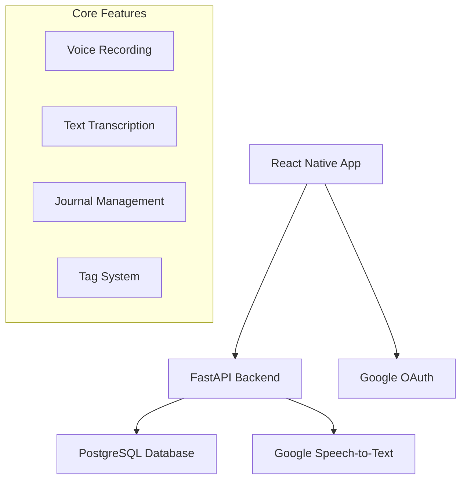
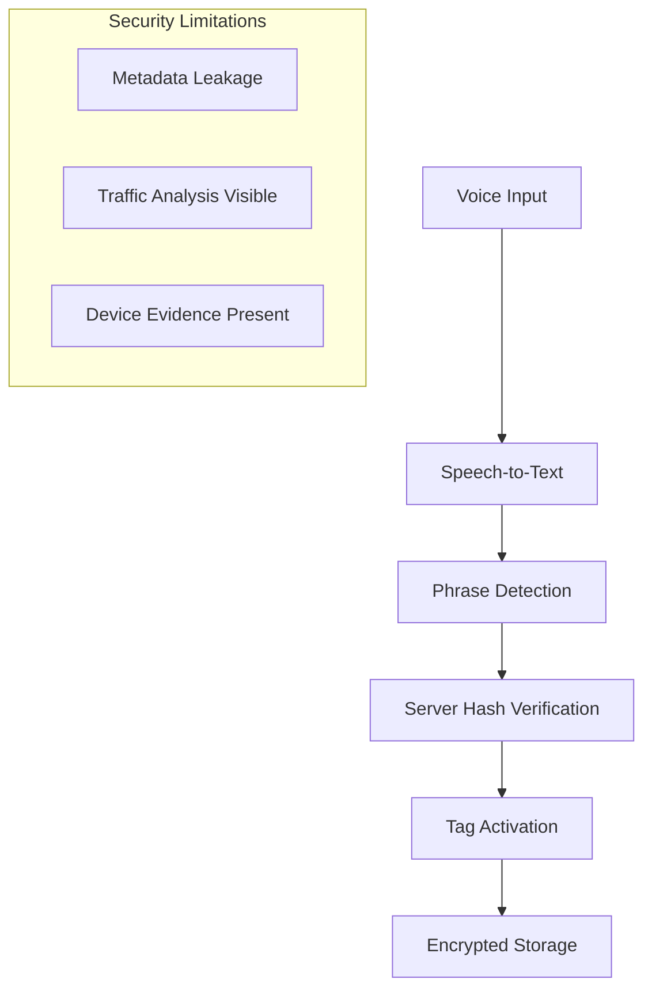
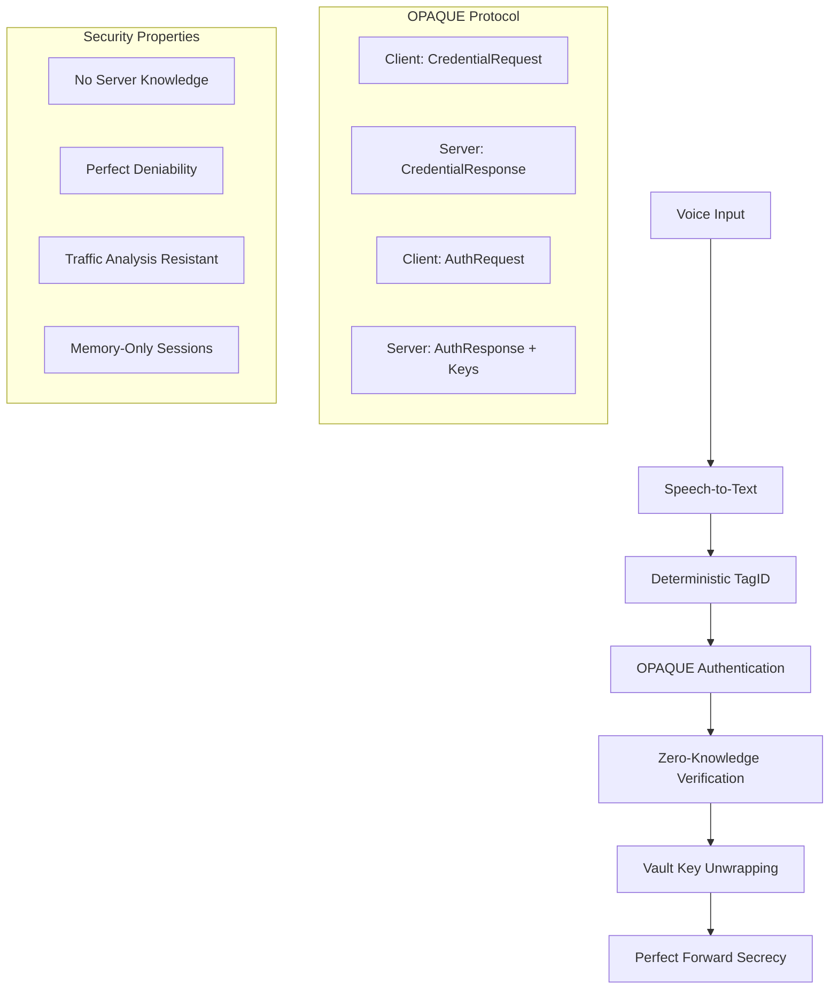
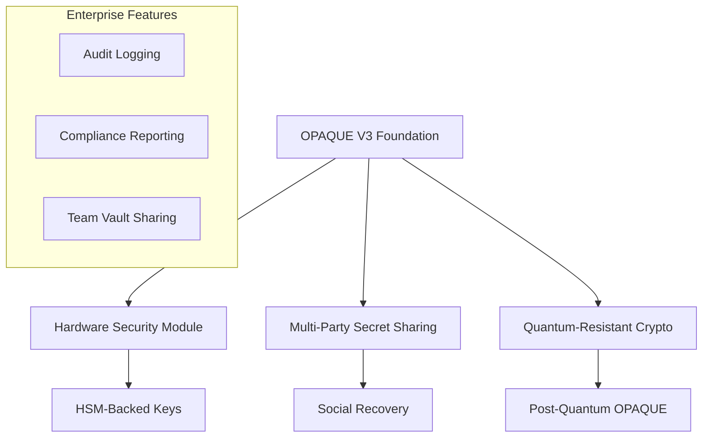
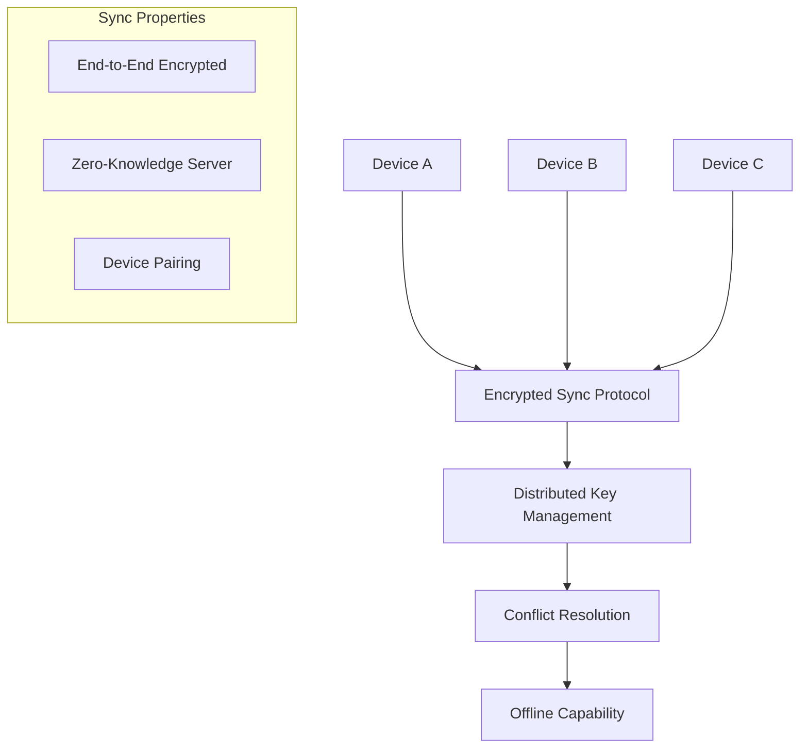

# Application Architecture & Feature Guide

## 1. Introduction

This document provides a detailed overview of the Vibes application's current architecture, core features, and development practices. Its purpose is to serve as a comprehensive guide for any developer or AI agent to quickly understand the system's design and begin contributing effectively.

## 2. Core Architectural Principles

Our architecture is guided by the following principles:

*   **Simplicity and User Focus:** We prioritize a simple, intuitive user experience. This is embodied by our unified, inline editing model for journal entries, which eliminates unnecessary navigation.
*   **Component Standardization:** We use consistent components and layouts, such as `SafeScrollView`, to ensure a predictable user experience and streamline development.
*   **Cross-Platform First:** The application is built with React Native to target mobile (iOS/Android) and web platforms simultaneously. All features must be designed and tested to function correctly in both environments. Platform-specific APIs (like confirmation dialogs) are handled gracefully.
*   **Separation of Concerns:** The application is split into a Python (FastAPI) backend and a TypeScript (React Native) frontend. Within each, logic is further separated into layers (API/endpoints, services, data models).

## 3. Frontend Architecture (React Native)

The frontend is responsible for the user interface, client-side logic, and communication with the backend.

### Navigation

The navigation is managed by `react-navigation` and is split into logical units:

*   `AuthNavigator.tsx`: Handles the login and registration screens for unauthenticated users.
*   `MainNavigator.tsx`: The primary navigator for authenticated users. It contains the main tab navigator and other screens like the `JournalEntryDetailScreen`.
*   `MainTabNavigator.tsx`: Provides the main bottom tab navigation for `HomeScreen`, `RecordScreen`, and `CalendarScreen`.

### Key Screens & Components

*   **`HomeScreen.tsx`**: The main landing screen, displaying a list of recent journal entries.
*   **`JournalEntryDetailScreen.tsx`**: This is a critical screen that embodies our "inline editing" principle. It serves as **both the viewer and the editor** for a journal entry. Users can modify the title, content, and tags directly on this single screen, with a "Save" button to persist changes. It is the default screen for new entries created from a recording.
*   **`RecordScreen.tsx`**: The dedicated screen for audio recording. It utilizes `useAudioRecording` and `useWebSocketTranscription` hooks to manage the recording state and stream audio data for real-time transcription.
*   **`TagsManager.tsx`**: A reusable component for adding, displaying, and removing tags. It is designed to work across platforms, using `window.confirm` as a fallback on the web for deletion confirmation.

### State Management

*   **React Context:** We use React's Context API for managing global state. Key contexts include:
    *   `AuthContext.tsx`: Manages user authentication state and tokens.
    *   `SettingsContext.tsx`: Manages user-configurable settings.
    *   `HiddenModeContext.tsx`: Manages the UI state related to "hidden" entries.

### Services Layer (`src/services/`)

This directory contains the bulk of the client-side business logic, abstracting it away from the UI components.

*   `api.ts`: A centralized Axios client for all HTTP communication with the backend API.
*   `encryptedJournalService.ts`: Manages the logic for fetching, decrypting, and saving encrypted journal entries. It orchestrates `api.ts` and the encryption services.
*   `speechToText.ts`: Contains logic related to the Speech-to-Text functionality, including WebSocket connections.
*   `tagManager.ts`: Handles fetching and managing tags.
*   **Encryption Services**:
    *   `clientEncryption.ts` & `zeroKnowledgeEncryption.ts`: Implement the core client-side encryption and decryption logic, ensuring that sensitive journal data is handled securely before being transmitted to the backend.
*   **Secret Tag Services**:
    *   `secretTagHashService.ts`: Generates client-side hashes of secret phrases.
    *   `secretTagOfflineManager.ts` & `secretTagOnlineManager.ts`: Manage the state and logic for the Secret Tags feature, both locally and in sync with the backend.

### Real-time Transcription

*   **Hook (`useWebSocketTranscription.ts`)**: Manages the WebSocket connection to the backend, streams audio chunks, and receives transcription results in real-time.
*   **UI (`AudioRecorder.tsx`)**: The UI component that uses the hook and displays the live transcription to the user.

## 4. Backend Architecture (FastAPI)

The backend is a Python application built with the FastAPI framework, serving a RESTful API to the frontend.

### API and Routing

*   **Versioning**: The API is versioned under `/api/v1/`.
*   **Endpoints (`app/api/v1/endpoints/`)**: Each file in this directory corresponds to a specific resource (e.g., `journal.py`, `speech.py`). Routers from these files are included in the main application in `app/main.py`.
*   **WebSocket (`app/websockets/speech.py`)**: A dedicated WebSocket endpoint handles real-time audio streaming for transcription via Google Cloud's Speech-to-Text API.

### Service Layer (`app/services/`)

Similar to the frontend, the backend uses a service layer to encapsulate business logic.

*   `journal_service.py`: Contains logic for creating, retrieving, and updating journal entries.
*   `user_service.py`: Manages user-related operations.
*   `auth_service.py`: Handles user authentication, password hashing, and JWT token generation.
*   `encryption_service.py`: Provides server-side utility functions for encryption, complementing the client-side implementation.
*   `speech_service.py`: Manages the interaction with the external Google Cloud Speech-to-Text API.

### Database

*   **PostgreSQL**: We use a PostgreSQL database for data persistence.
*   **ORM**: `SQLAlchemy` is used as the Object-Relational Mapper.
    *   **Models (`app/models/`)**: Each file defines a database table schema (e.g., `journal_entry.py`, `user.py`).
    *   **Session (`app/db/session.py`)**: Manages database connections and sessions.
*   **Migrations**: `Alembic` is used for managing database schema migrations, with migration scripts located in the `migrations/versions/` directory.

## 5. Key Feature Deep Dive: Secret Tags

The Secret Tags feature is a cornerstone of the application's privacy model.

1.  **User Setup**: The user sets up a secret phrase in the app. This phrase is **never** sent to the server.
2.  **Hashing**: `secretTagHashService.ts` on the client uses this phrase to generate a unique hash.
3.  **Tag Association**: When a user applies a "secret tag" to a journal entry, this hash is associated with the entry and stored on the backend.
4.  **Entry Hiding**: The `HiddenModeContext` on the frontend checks if "hidden mode" is active. If it is, any journal entry associated with a secret tag hash is filtered from view in lists like the `HomeScreen`. This allows users to quickly toggle the visibility of their most private entries.

This client-centric approach ensures the server has no knowledge of the user's secret phrase, providing a strong layer of privacy.

## 6. Development Scripts (`/scripts`)

The project includes a comprehensive set of shell scripts in the `/scripts` directory to streamline development, testing, and deployment workflows. All scripts should be run from the project root directory.

### Core Development Scripts

#### `setup.sh` - Initial Project Setup
Sets up the entire development environment from scratch:
- Installs system dependencies (Python dev tools, PostgreSQL, build essentials)
- Activates the Python virtual environment (`.venv` in project root)
- Installs backend dependencies from `requirements.txt`
- Starts PostgreSQL service and creates the `vibes_db` database
- Creates default PostgreSQL user with credentials (`postgres`/`password`)
- Runs Alembic database migrations
- Creates a test user (`test@example.com`/`password`) for development
- Installs frontend dependencies via `npm install`

**Usage:** `./scripts/setup.sh`

#### `start.sh` - Application Startup
Starts both backend and frontend services:
- Calls `stop.sh` first to clean up any existing processes
- Activates the Python virtual environment
- Starts FastAPI backend on port 8001 (with automatic port conflict resolution)
- Starts React Native web frontend on an available port (19000-19006 range)
- Creates PID files (`.server.pid`, `.frontend.pid`) for process management
- Logs output to `/logs/backend.log`, `/logs/frontend.log` (and error variants)
- Provides health check URLs and log file locations

**Usage:** `./scripts/start.sh`

#### `stop.sh` - Application Shutdown
Gracefully stops all application processes:
- Kills processes using PID files with graceful shutdown (SIGTERM) followed by force kill (SIGKILL) if needed
- Cleans up orphaned processes by pattern matching (uvicorn, node/expo/metro)
- Frees up ports 8001 and 19000-19006 by killing any processes listening on them
- Removes PID files
- Optionally stops PostgreSQL (commented out by default)

**Usage:** `./scripts/stop.sh`

### Database Management Scripts

#### `start_db.sh` - Database Service Management
Ensures PostgreSQL service is running:
- Detects the appropriate service manager (systemctl vs service vs manual)
- Handles different environments (systemd vs SysV init vs WSL)
- Starts PostgreSQL service if not already running
- Waits for service to become ready with retry logic
- Provides detailed status feedback

**Usage:** `./scripts/start_db.sh`

#### `stop_db.sh` - Database Service Shutdown
Stops the PostgreSQL service:
- Uses the same environment detection as `start_db.sh`
- Gracefully stops PostgreSQL service
- Verifies the service has stopped
- Handles different service management systems

**Usage:** `./scripts/stop_db.sh`

### Testing Scripts

#### `test-secret-tags.sh` - Comprehensive Test Suite
A specialized test runner for the Secret Tags feature:
- **Backend Tests:** Runs pytest with CI/CD optimized tests, unit tests, integration tests, and zero-knowledge compliance tests
- **Frontend Tests:** Runs Jest tests for Secret Tags services and all frontend components
- **Options:**
  - `--backend-only`: Run only backend tests
  - `--frontend-only`: Run only frontend tests
  - `--integration`: Include integration tests
  - `--performance`: Run performance benchmarks
  - `--coverage`: Generate coverage reports
  - `--verbose`: Detailed output
- **Environment Checks:** Validates Python/Node.js versions and project structure
- **Reporting:** Generates timestamped test reports

**Usage:** `./scripts/test-secret-tags.sh [options]`

### Key Technical Details

#### Process Management
- All scripts use PID files stored in the project root (`.server.pid`, `.frontend.pid`)
- Graceful shutdown with fallback to force kill
- Port conflict detection and resolution
- Orphaned process cleanup by pattern matching

#### Environment Detection
- Scripts detect systemctl vs service vs manual service management
- Handle WSL, Docker, and traditional Linux environments
- Automatic fallback mechanisms for different system configurations

#### Logging Strategy
- Centralized logging in `/logs` directory at project root
- Separate log files for stdout and stderr
- Timestamped log entries for debugging

#### Database Configuration
- Default PostgreSQL setup: `vibes_db` database, `postgres` user, `password` password
- Automatic database creation and user setup
- Migration management via Alembic
- Test user creation for development

### Development Workflow
1. **Initial Setup:** `./scripts/setup.sh` (run once)
2. **Daily Development:** `./scripts/start.sh` to start, `./scripts/stop.sh` to stop
3. **Database Management:** Use `start_db.sh`/`stop_db.sh` for isolated database control
4. **Testing:** Use `test-secret-tags.sh` for comprehensive testing of the Secret Tags feature

All scripts include comprehensive error handling, status reporting, and are designed to be idempotent (safe to run multiple times).

# Vibes - Architecture and Feature Evolution

## Current Architecture Overview

Vibes is a cross-platform voice journaling application built with React Native (frontend) and FastAPI (backend), featuring advanced **OPAQUE-based zero-knowledge encryption** for sensitive content protection.

### Technology Stack
- **Frontend**: React Native with TypeScript
- **Backend**: FastAPI (Python) with PostgreSQL
- **Authentication**: Google OAuth 2.0
- **Speech Processing**: Google Cloud Speech-to-Text V2
- **Encryption**: OPAQUE protocol with Argon2id, HKDF, AES-GCM
- **Deployment**: Local development, GCP production planned

## Architecture Evolution

### Phase 1: Basic Voice Journaling (Completed)


### Phase 2: Secret Tags V2 - Argon2 Implementation (Current)


**Current Limitations:**
- Server can see authentication attempts
- Network traffic reveals secret tag existence
- Client stores tag metadata locally

### Phase 3: OPAQUE Zero-Knowledge V3 (In Development)


## Cryptographic Architecture Evolution

### Secret Tags V2 (Current - Argon2-based)
```typescript
// Current Implementation - Security Limitations
class SecretTagV2 {
  // ❌ Client fetches all user's secret tag metadata
  async getAllSecretTags(): Promise<SecretTag[]> {
    return await api.get('/api/secret-tags/'); // Reveals existence
  }
  
  // ❌ Loops through all tags for verification
  async verifyPhrase(phrase: string): Promise<boolean> {
    const tags = await this.getAllSecretTags(); // Metadata leak
    for (const tag of tags) {
      const result = await api.post('/verify-phrase', { // Traffic analysis
        tag_id: tag.id,
        phrase: phrase
      });
      if (result.isValid) return true;
    }
    return false;
  }
}
```

### Secret Tags V3 (OPAQUE - Zero-Knowledge)
```typescript
// New Implementation - True Zero-Knowledge
class SecretTagV3 {
  // ✅ Deterministic TagID from phrase - no server query needed
  deriveTagId(phrase: string): Uint8Array {
    return blake2s(phrase, 16); // 128-bit deterministic ID
  }
  
  // ✅ OPAQUE authentication - server learns nothing
  async authenticatePhrase(phrase: string): Promise<AuthResult> {
    const tagId = this.deriveTagId(phrase);
    
    // OPAQUE protocol - zero-knowledge authentication
    const opaque = new OpaqueClient();
    const credentialRequest = opaque.createCredentialRequest(phrase);
    
    const initResponse = await api.post('/api/v3/auth/init', {
      user_id: getCurrentUserId(),
      tag_id: tagId,
      client_msg1: credentialRequest
    });
    
    const authRequest = opaque.createAuthRequest(initResponse.server_msg1);
    const finalResponse = await api.post('/api/v3/auth/finalize', {
      session_id: initResponse.session_id,
      client_msg2: authRequest
    });
    
    if (finalResponse.success) {
      // Server provided wrapped keys without learning anything
      return this.unwrapVaultKeys(finalResponse.wrapped_keys, phrase);
    }
    
    return { authenticated: false, phrase }; // Treat as regular text
  }
}
```

## Database Schema Evolution

### Current Schema (V2)
```sql
-- Current secret tags with metadata leakage
CREATE TABLE secret_tags (
    id VARCHAR(36) PRIMARY KEY,
    user_id INTEGER NOT NULL,
    tag_name VARCHAR(100) NOT NULL,        -- ❌ Reveals tag names
    phrase_salt BYTEA NOT NULL,            -- ❌ Client downloads all salts
    phrase_hash VARCHAR(255) NOT NULL,     -- ❌ Argon2 hash
    color_code VARCHAR(7) NOT NULL,        -- ❌ UI metadata exposed
    created_at TIMESTAMP DEFAULT NOW()
);
```

### New Schema (V3 - OPAQUE)
```sql
-- OPAQUE zero-knowledge secret tags
CREATE TABLE secret_tags_v3 (
    tag_id BYTEA(16) PRIMARY KEY,          -- ✅ Deterministic from Hash(phrase)
    user_id UUID NOT NULL,
    salt BYTEA(16) NOT NULL,               -- ✅ Random salt for Argon2id
    verifier_kv BYTEA(32) NOT NULL,        -- ✅ OPAQUE verifier only
    opaque_envelope BYTEA NOT NULL,        -- ✅ OPAQUE registration data
    created_at TIMESTAMP DEFAULT NOW(),
    INDEX idx_user_tags (user_id),
    INDEX idx_tag_lookup (tag_id)
);

-- Wrapped keys for vault access
CREATE TABLE wrapped_keys (
    id UUID PRIMARY KEY,
    tag_id BYTEA(16) NOT NULL,
    vault_id UUID NOT NULL,
    wrapped_key BYTEA(40) NOT NULL,        -- ✅ AES-KW wrapped data key
    created_at TIMESTAMP DEFAULT NOW()
);

-- Encrypted vault blobs (zero-knowledge storage)
CREATE TABLE vault_blobs (
    vault_id UUID NOT NULL,
    object_id UUID NOT NULL,
    iv BYTEA(12) NOT NULL,                 -- ✅ AES-GCM IV
    ciphertext BYTEA NOT NULL,             -- ✅ Encrypted content only
    created_at TIMESTAMP DEFAULT NOW(),
    PRIMARY KEY (vault_id, object_id)
);
```

## API Evolution

### Current API (V2 - Metadata Exposure)
```typescript
// ❌ Current endpoints expose secret tag existence
GET  /api/secret-tags/              // Returns all user tags (metadata leak)
POST /api/secret-tags/verify-phrase // Reveals verification attempts
POST /api/secret-tags/create        // Direct tag creation
```

### New API (V3 - Zero-Knowledge)
```typescript
// ✅ OPAQUE zero-knowledge endpoints
POST /api/v3/secret-tags/register   // OPAQUE registration
POST /api/v3/secret-tags/auth/init  // OPAQUE authentication init
POST /api/v3/secret-tags/auth/finalize // OPAQUE authentication complete

POST /api/v3/vaults/upload          // Encrypted blob storage
GET  /api/v3/vaults/{vault_id}/objects // Encrypted blob retrieval
```

## Security Property Comparison

| Security Property | V2 (Argon2) | V3 (OPAQUE) |
|-------------------|-------------|-------------|
| **Server Knowledge** | ❌ Sees authentication attempts | ✅ Zero-knowledge verification |
| **Device Deniability** | ❌ Tag metadata stored locally | ✅ No persistent evidence |
| **Traffic Analysis** | ❌ Patterns reveal secret usage | ✅ OPAQUE obscures patterns |
| **Forward Secrecy** | ❌ Keys may persist | ✅ Memory-only sessions |
| **Coercion Resistance** | ❌ Cannot deny secret existence | ✅ Perfect deniability |
| **Database Compromise** | ❌ Reveals tag structure | ✅ Only opaque verifiers |

## Migration Strategy

### Phase 1: Parallel Implementation
```typescript
// Run both systems simultaneously
class HybridSecretTagManager {
  private v2Manager = new SecretTagOnlineManager();
  private v3Manager = new OpaqueSecretTagManager();
  
  async checkForSecretPhrase(phrase: string): Promise<TagDetectionResult> {
    // Try V3 first (new tags)
    const v3Result = await this.v3Manager.authenticatePhrase(phrase);
    if (v3Result.authenticated) {
      return { found: true, version: 'v3', ...v3Result };
    }
    
    // Fallback to V2 (existing tags)
    const v2Result = await this.v2Manager.checkForSecretTagPhrases(phrase);
    if (v2Result.found) {
      return { found: true, version: 'v2', ...v2Result };
    }
    
    return { found: false };
  }
}
```

### Phase 2: User Migration
```typescript
// Migration flow for existing users
class SecretTagMigration {
  async migrateUserToOPAQUE(userId: string): Promise<MigrationResult> {
    // 1. Identify existing V2 secret tags
    const existingTags = await this.v2Manager.getAllSecretTags();
    
    // 2. User re-enters phrases (security requirement)
    const migrationData = await this.collectUserPhrases(existingTags);
    
    // 3. Create V3 tags with OPAQUE
    for (const { phrase, tagName } of migrationData) {
      await this.v3Manager.createSecretTag(phrase, tagName);
    }
    
    // 4. Migrate encrypted vault data
    await this.migrateVaultData(existingTags);
    
    // 5. Securely delete V2 data
    await this.cleanupV2Data(existingTags);
    
    return { success: true, migratedTags: existingTags.length };
  }
}
```

## Performance Considerations

### V2 Performance Profile
- **Tag Lookup**: O(n) server queries per phrase check
- **Network Overhead**: Multiple round trips for verification
- **Memory Usage**: Tag metadata cached locally
- **Battery Impact**: Frequent network requests

### V3 Performance Profile  
- **Tag Lookup**: O(1) deterministic TagID generation
- **Network Overhead**: Fixed 2 round trips for OPAQUE
- **Memory Usage**: Session-only key storage
- **Battery Impact**: Optimized with cover traffic batching

## Future Architecture Roadmap

### Phase 4: Advanced Security Features


### Phase 5: Cross-Device Synchronization


## Technical Debt and Cleanup

### Current Technical Debt
1. **Mixed Encryption Systems**: V1 (offline) + V2 (online) + V3 (OPAQUE)
2. **Database Schema Overlap**: Multiple secret tag tables
3. **API Versioning**: Need clean separation between versions
4. **Client Code Complexity**: Multiple manager classes

### Cleanup Strategy
1. **Phase Out V1**: Remove offline-only secret tag system
2. **Maintain V2**: Keep for backward compatibility during migration
3. **Promote V3**: Make OPAQUE the default for new users
4. **Consolidate APIs**: Clean endpoint structure
5. **Simplify Client**: Single manager interface with version detection

## Conclusion

The evolution from Argon2-based secret tags (V2) to OPAQUE zero-knowledge (V3) represents a fundamental architectural shift that solves previously impossible security requirements:

- **True Zero-Knowledge**: Server learns nothing about user secrets
- **Perfect Deniability**: No evidence of secret functionality on device
- **Traffic Analysis Resistance**: OPAQUE protocol obscures patterns
- **Forward Secrecy**: Session-only key existence

This architecture positions Vibes as the most secure voice journaling platform available, suitable for users with the highest privacy and security requirements while maintaining the intuitive voice-driven user experience. 