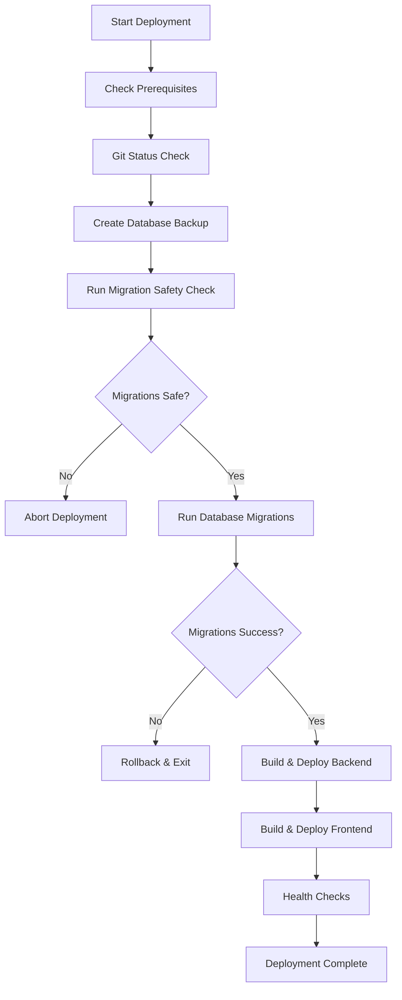

# Database Migration Strategy for Production Deployments

## 🎯 Overview

This document defines the safe deployment strategy for database migrations in Kotori's production environment. The strategy prioritizes **data safety**, **zero-downtime deployment**, and **rollback capability**.

## 🔍 Current Migration System Analysis

### Technology Stack
- **Migration Tool**: Alembic 1.12.1
- **Database**: PostgreSQL 17 (Cloud SQL)
- **ORM**: SQLAlchemy 2.0.23
- **Current Head**: `7c39d7b141c7` (add_consent_audit_fields_to_share_access)

### Migration Chain Status
```
7c39d7b141c7 (head) ← add_consent_audit_fields_to_share_access
↑
add_sharing_tables ← Sharing functionality tables
↑
add_share_templates_manual ← Share templates
↑
[... previous migrations ...]
```

### Key Migration Files
- **Configuration**: `backend/alembic.ini`
- **Environment**: `backend/migrations/env.py` 
- **Versions**: `backend/migrations/versions/`
- **Latest Migration**: `7c39d7b141c7_add_consent_audit_fields_to_share_access.py`

## 🛡️ Safety-First Migration Strategy

### Phase 1: Pre-Deployment Validation

#### 1.1 Migration Safety Check
```bash
# Check migration history consistency
cd backend
alembic history --verbose

# Validate migration syntax (dry-run)
alembic upgrade head --sql > migration_preview.sql

# Review generated SQL for safety
cat migration_preview.sql
```

#### 1.2 Production Database Backup
```bash
# Create point-in-time backup before migration
gcloud sql backups create --instance=kotori-db-instance --description="Pre-migration backup $(date +%Y%m%d-%H%M%S)"

# Verify backup exists
gcloud sql backups list --instance=kotori-db-instance --limit=5
```

#### 1.3 Migration Impact Assessment
- **Data Loss Risk**: ❌ No DROP COLUMN or DROP TABLE operations
- **Downtime Required**: ✅ Only for schema changes requiring locks
- **Rollback Complexity**: ✅ Simple - all migrations have downgrade functions
- **Performance Impact**: ⚠️ Index creation may temporarily impact queries

### Phase 2: Safe Migration Deployment

#### 2.1 Migration Execution Strategy

**Option A: Zero-Downtime (Recommended)**
```bash
# Run migrations before deploying new application code
# This allows old code to continue running during migration
alembic upgrade head
```

**Option B: Maintenance Window**
```bash
# For migrations requiring application downtime
# 1. Stop application traffic
# 2. Run migrations
# 3. Deploy new application code
# 4. Resume traffic
```

#### 2.2 Migration Command Integration

Add to deployment script **before** application deployment:

```bash
# In cloud-deploy.sh - Backend deployment section
print_step "Running Database Migrations"

# Set up migration environment
export DATABASE_URL=$(gcloud secrets versions access latest --secret="database-url")

# Run migrations with proper error handling
cd "$PROJECT_ROOT/backend"
if ! alembic upgrade head; then
    print_error "Database migration failed"
    print_warning "Manual intervention required"
    exit 1
fi

print_success "Database migrations completed"
```

### Phase 3: Post-Migration Validation

#### 3.1 Migration Success Verification
```bash
# Verify current migration state
alembic current

# Check database connectivity and basic queries
python -c "
from app.core.database import get_db
from app.models.user import User
import asyncio

async def test_db():
    async for db in get_db():
        result = await db.execute('SELECT COUNT(*) FROM users')
        print(f'User count: {result.scalar()}')
        break

asyncio.run(test_db())
"
```

#### 3.2 Application Health Check
```bash
# Deploy application and test critical endpoints
curl -f "$BACKEND_URL/api/health"
curl -f "$BACKEND_URL/api/v1/auth/me" -H "Authorization: Bearer test_token"
```

## 🚨 Rollback Procedures

### Immediate Rollback (Application Level)
```bash
# Rollback to previous Cloud Run revision
gcloud run services update-traffic kotori-api \
    --to-revisions=PREVIOUS_REVISION=100 \
    --region=us-central1
```

### Database Rollback (Schema Level)
```bash
# Identify target revision for rollback
alembic history

# Rollback to specific revision
alembic downgrade REVISION_ID

# Verify rollback success
alembic current
```

### Emergency Rollback (Full Restore)
```bash
# Restore from backup (LAST RESORT)
gcloud sql backups restore BACKUP_ID \
    --restore-instance=kotori-db-instance \
    --backup-instance=kotori-db-instance
```

## 🔧 Integration with Deployment Script

### Modified Deployment Flow



### Migration Step Implementation

```bash
# Add to cloud-deploy.sh
run_database_migrations() {
    print_step "Database Migration Phase"
    
    cd "$PROJECT_ROOT/backend"
    
    # Create backup
    BACKUP_DESCRIPTION="pre-migration-$(date +%Y%m%d-%H%M%S)"
    gcloud sql backups create \
        --instance=kotori-db-instance \
        --description="$BACKUP_DESCRIPTION"
    
    # Check current migration status
    CURRENT_REVISION=$(alembic current 2>/dev/null | grep -v "INFO" || echo "none")
    print_step "Current database revision: $CURRENT_REVISION"
    
    # Generate migration preview
    alembic upgrade head --sql > /tmp/migration_preview.sql
    
    # Show what will be executed
    echo "Migrations to be applied:"
    alembic upgrade head --sql | grep -E "(CREATE|ALTER|DROP|INSERT)" | head -10
    
    # Execute migrations
    if alembic upgrade head; then
        print_success "Database migrations completed successfully"
        NEW_REVISION=$(alembic current | grep -v "INFO")
        print_success "Database updated to revision: $NEW_REVISION"
    else
        print_error "Database migration failed"
        print_error "Backup available: $BACKUP_DESCRIPTION"
        exit 1
    fi
}
```

## 📋 Migration Deployment Checklist

### Pre-Deployment
- [ ] **Backup Created**: Point-in-time backup before migration
- [ ] **Migration Preview**: SQL reviewed for safety
- [ ] **Rollback Plan**: Downgrade path confirmed
- [ ] **Team Notification**: Stakeholders informed of deployment window

### During Deployment  
- [ ] **Migration Execution**: Alembic upgrade successful
- [ ] **Revision Verification**: Current revision matches expected
- [ ] **Basic Connectivity**: Database responds to queries
- [ ] **Application Deployment**: Backend/frontend deployed successfully

### Post-Deployment
- [ ] **Health Checks**: All endpoints responding
- [ ] **Feature Testing**: New functionality works correctly
- [ ] **Performance Check**: No degradation in response times
- [ ] **Monitoring**: Logs show no migration-related errors

## ⚠️ Migration Risk Assessment

### Low Risk Migrations
- ✅ **Add Column** (nullable): Safe, no downtime
- ✅ **Add Index**: May cause temporary performance impact
- ✅ **Add Table**: Safe, no impact on existing data

### Medium Risk Migrations
- ⚠️ **Alter Column** (compatible): Test thoroughly
- ⚠️ **Add Constraint**: May fail on existing data
- ⚠️ **Rename Column**: Requires application compatibility

### High Risk Migrations  
- ❌ **Drop Column**: Requires careful coordination
- ❌ **Drop Table**: Data loss risk
- ❌ **Data Migration**: Large dataset transformations

## 🔍 Monitoring and Alerts

### Migration Monitoring
```bash
# Monitor migration progress
tail -f /var/log/alembic.log

# Check database locks during migration
SELECT * FROM pg_locks WHERE NOT granted;

# Monitor active connections
SELECT count(*) FROM pg_stat_activity;
```

### Post-Migration Monitoring
- **Database Performance**: Query response times
- **Application Errors**: Migration-related failures
- **Data Integrity**: Spot checks on critical tables
- **User Experience**: Frontend functionality validation

## 🎯 Success Criteria

A migration deployment is considered successful when:

1. ✅ **Migration Completed**: Alembic reports success
2. ✅ **Application Healthy**: All health checks pass
3. ✅ **Features Functional**: New/existing features work correctly
4. ✅ **Performance Maintained**: No significant degradation
5. ✅ **No Data Loss**: All existing data preserved
6. ✅ **Rollback Tested**: Rollback procedure verified (in staging)

## 📚 Related Documentation

- [Deployment Script](../../scripts/cloud-deploy.sh)
- [Deployment Troubleshooting](./DEPLOYMENT_TROUBLESHOOTING.md)
- [Alembic Documentation](https://alembic.sqlalchemy.org/en/latest/)
- [PostgreSQL Backup/Restore](https://cloud.google.com/sql/docs/postgres/backup-recovery)

---

*Last Updated: August 14, 2025*  
*Current Production Revision: 7c39d7b141c7*
