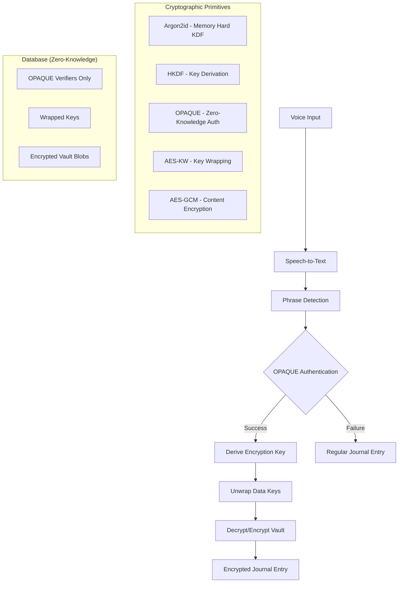

# Vibes - Voice Journaling App Development Plan

## Project Overview

Vibes is a cross-platform voice journaling application that enables users to record, transcribe, and organize their thoughts through speech. The app features advanced **OPAQUE-based zero-knowledge encryption** for secret tags, providing military-grade security for sensitive content while maintaining perfect deniability.

## Current Status: OPAQUE Zero-Knowledge Implementation Phase

### Completed Features ✅
- **Core Voice Recording**: High-quality audio capture and playback
- **Google Speech-to-Text V2**: Advanced transcription with punctuation and formatting
- **Journal Management**: Create, edit, delete, and organize entries
- **Tag System**: Public tags for categorization and filtering
- **User Authentication**: Secure login and session management
- **Database Integration**: PostgreSQL with proper migrations
- **Cross-Platform Support**: React Native for iOS, Android, and web

### Current Implementation: Secret Tags V2 (Argon2-based)
- Basic server-side hash verification
- Memory-only tag activation
- Timeout-based deactivation
- **SECURITY LIMITATION**: Metadata leakage reveals secret tag existence

## NEW ARCHITECTURE: OPAQUE Zero-Knowledge Secret Tags V3

### Revolutionary Security Model

The new implementation addresses fundamental cryptographic challenges to achieve:

1. **True Zero-Knowledge Server** - Server never sees secret phrases or content
2. **Perfect Device Deniability** - No persistent evidence of secret functionality
3. **Traffic Analysis Resistance** - OPAQUE protocol obscures authentication patterns
4. **Forward Secrecy** - Keys exist only in RAM during active sessions
5. **Duress Protection** - Panic modes and fake vault support

### Technical Architecture



### Key Innovations

#### 1. Deterministic TagID Generation
```typescript
// No client storage needed - derived from phrase
const tagId = blake2s(secretPhrase, 16); // 128-bit identifier
```

#### 2. OPAQUE Password-Authenticated Key Exchange
```typescript
// Server learns nothing about phrase or authentication result
const authResult = await opaqueAuthenticate(phrase, tagId);
if (authResult.success) {
  // Unwrap vault keys and activate session
  const dataKeys = unwrapKeys(authResult.wrappedKeys);
}
```

#### 3. Perfect Forward Secrecy
```typescript
// Keys exist only in RAM during active session
setActiveSession({
  dataKeys,
  expiresAt: Date.now() + (5 * 60 * 1000) // 5 minutes
});

// Automatic cleanup on timeout
setTimeout(() => clearAllKeys(), timeout);
```

## Implementation Phases

### Phase 1: Cryptographic Foundation (Weeks 1-2)
**Goal**: Establish OPAQUE infrastructure and key derivation systems

**Key Deliverables**:
- OPAQUE library integration (frontend/backend)
- Deterministic key derivation schedule
- Secure memory management utilities
- TagID generation from phrase hashes

**Success Criteria**:
- OPAQUE authentication round-trip working
- Key derivation producing consistent results
- Memory cleared after operations

### Phase 2: Server Infrastructure (Weeks 3-4)
**Goal**: Build zero-knowledge backend systems

**Key Deliverables**:
- Database schema for OPAQUE verifiers and vault blobs
- Authentication endpoints with session management
- Wrapped key storage and retrieval
- Vault blob upload/download APIs

**Success Criteria**:
- OPAQUE registration and authentication endpoints functional
- Encrypted vault storage working
- No plaintext secrets stored on server

### Phase 3: Client Integration (Weeks 5-6)
**Goal**: Integrate OPAQUE with voice journaling workflow

**Key Deliverables**:
- Voice phrase detection with OPAQUE authentication
- Encrypted journal entry creation and retrieval
- Session management and timeout handling
- User interface for secret tag management

**Success Criteria**:
- Voice-activated secret tag authentication working
- Encrypted entries properly stored and retrieved
- Seamless fallback to regular entries on auth failure

### Phase 4: Security Hardening (Weeks 7-8)
**Goal**: Implement advanced security features

**Key Deliverables**:
- Cover traffic to resist traffic analysis
- Panic mode and duress protection
- Memory security and timing attack resistance
- Perfect forward secrecy implementation

**Success Criteria**:
- Traffic patterns indistinguishable from normal use
- Panic mode rapidly destroys all secret data
- No sensitive data persists in memory after sessions

### Phase 5: Testing & Deployment (Weeks 9-10)
**Goal**: Comprehensive testing and migration strategy

**Key Deliverables**:
- Cryptographic protocol compliance testing
- Security penetration testing
- Migration tools for existing users
- Performance optimization and monitoring

**Success Criteria**:
- All security properties verified
- Existing users successfully migrated
- Performance meets or exceeds current system

## Migration Strategy

### Backward Compatibility
- Run OPAQUE V3 alongside current Argon2 V2 system
- New secret tags use OPAQUE, existing tags remain functional
- Gradual user migration with clear security benefits

### User Migration Flow
1. **Education**: Explain security benefits of OPAQUE upgrade
2. **Consent**: User opts into migration process
3. **Re-authentication**: User re-enters secret phrases (security requirement)
4. **Data Migration**: Existing encrypted entries moved to new vault system
5. **Cleanup**: Old system data securely deleted

### Risk Mitigation
- Feature flags for gradual rollout
- Comprehensive backup before migration
- Rollback capability if issues arise
- User support for migration assistance

## Security Analysis

### Threat Model Protection

| Threat | Current V2 | OPAQUE V3 |
|--------|------------|-----------|
| **Server Compromise** | ❌ Hash verification reveals secret tag existence | ✅ Zero-knowledge - no secrets revealed |
| **Device Forensics** | ❌ Network traffic shows secret tag verification | ✅ No persistent evidence of secret functionality |
| **Traffic Analysis** | ❌ Authentication patterns visible | ✅ OPAQUE obscures success/failure |
| **Coercion/Duress** | ❌ Cannot deny secret tag existence | ✅ Perfect deniability + panic modes |
| **Memory Attacks** | ❌ Keys may persist in memory | ✅ Secure erasure and session isolation |

### Cryptographic Guarantees

1. **Computational Security**: Based on well-established primitives (Argon2id, HKDF, AES)
2. **Protocol Security**: OPAQUE provides formal security proofs
3. **Implementation Security**: Constant-time operations and side-channel resistance
4. **Forward Secrecy**: Past sessions remain secure even if current session compromised

## Performance Considerations

### Mobile Optimization
- Argon2id parameters tuned for mobile devices (1 iteration vs 3 for desktop)
- Efficient OPAQUE implementation with minimal battery impact
- Background processing for cover traffic

### Network Efficiency
- Batched operations to reduce round trips
- Compressed vault blob storage
- Efficient binary serialization for OPAQUE messages

### User Experience
- Authentication typically completes in <500ms
- Seamless fallback to regular entries on failure
- Visual indicators for active secret sessions

## Success Metrics

### Security Metrics
- Zero plaintext secrets stored on server
- No authentication success/failure distinguishable in traffic
- Memory cleared within 1 second of session end
- Panic mode destroys all secrets within 2 seconds

### Performance Metrics
- OPAQUE authentication completes in <500ms
- Voice phrase detection accuracy >95%
- Battery impact <5% increase over current system
- Network overhead <10% increase in data usage

### User Experience Metrics
- Migration completion rate >90%
- User satisfaction with security improvements
- Support ticket volume remains stable
- Feature adoption rate >60% within 3 months

## Risk Assessment

### Technical Risks
- **OPAQUE Library Maturity**: Mitigation - Thorough evaluation and testing
- **Mobile Performance**: Mitigation - Extensive mobile device testing
- **Migration Complexity**: Mitigation - Gradual rollout with fallback options

### Security Risks
- **Implementation Vulnerabilities**: Mitigation - Security audit and penetration testing
- **Side-Channel Attacks**: Mitigation - Constant-time operations and secure coding
- **Social Engineering**: Mitigation - User education and duress protection

### Business Risks
- **User Adoption**: Mitigation - Clear communication of security benefits
- **Development Timeline**: Mitigation - Phased implementation with MVP milestones
- **Regulatory Compliance**: Mitigation - Legal review of zero-knowledge claims

## Future Roadmap

### Post-Launch Enhancements (Months 4-6)
- Hardware security module integration
- Multi-party secret sharing for recovery
- Biometric authentication integration
- Cross-device synchronization

### Advanced Features (Months 7-12)
- Quantum-resistant cryptography preparation
- Voice pattern analysis for additional security
- Distributed backup and recovery systems
- Enterprise-grade audit and compliance features

## Conclusion

The OPAQUE Zero-Knowledge implementation represents a fundamental leap forward in voice journaling security. By solving the previously impossible trilemma of zero-knowledge server, device deniability, and efficient authentication, Vibes will offer unparalleled protection for sensitive personal content while maintaining the intuitive voice-driven user experience.

This architecture positions Vibes as the most secure voice journaling platform available, suitable for users with the highest security requirements including journalists, activists, legal professionals, and privacy-conscious individuals worldwide. 